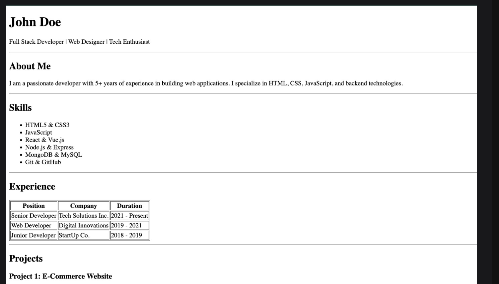

# Single Page Resume

This project is a simple, clean, and responsive single-page resume template built with HTML and CSS.

## Setup

To view the resume locally:

1.  Clone or download this repository.
2.  Open the folder containing the `index.html` file.
3.  Double-click `index.html` to open it in your default web browser.

## Usage

Feel free to customize this resume with your own details:

1.  Open `index.html` in a code editor (like VS Code, Notepad++, or Sublime Text).
2.  Edit the text within the HTML tags to update your name, contact information, skills, experience, and projects.
3.  Save the file and refresh your browser to see the changes.

## Screenshot

*The above screenshot serves as a design reference for this resume.*
